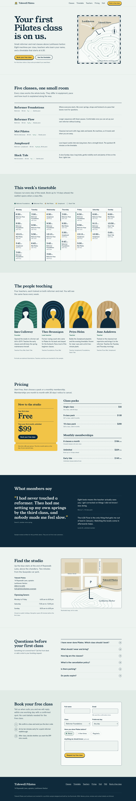

# Tidewell Pilates

A single-page marketing site for Tidewell Pilates, a small reformer and mat studio in the harbor town of Larkhaven.

This is a portfolio sample by Joe Dymnioski. **Tidewell Pilates, Larkhaven, the teachers, prices, reviews and contact details are all invented.** The phone number uses the 555 range and the email uses the reserved `.example` domain.



## What's on the page

- Hero with the intro offer (first class free) and an illustrated nautical chart of the harbor
- Five class types with equipment, length and pace
- Weekly timetable: a seven-column grid on desktop, day tabs on mobile
- Four teachers with abstract SVG portraits
- Pricing: intro offer, class packs and monthly memberships
- Member quotes (written for the demo and labeled as such)
- Location with an illustrated street map and opening hours
- FAQ built on `<details>`/`<summary>`
- Booking request form (front end only, see below)

## Stack

- [Astro](https://astro.build) 7, static output, no UI framework
- Scoped Astro styles plus one global stylesheet of design tokens (`src/styles/global.css`)
- Self-hosted fonts via Fontsource: Young Serif (display) and Hanken Grotesk (text)
- All imagery is inline SVG drawn for this project; depth contours are generated at build time (`src/lib/contours.ts`)
- `@astrojs/sitemap` for `sitemap-index.xml`

Client JavaScript is limited to three small scripts, each a progressive enhancement:

| Script | Without JS |
| --- | --- |
| Mobile menu toggle | Nav links wrap below the logo |
| Timetable day tabs (mobile only) | All seven days are listed in order |
| Form validation messages | Native browser validation runs |

## Project structure

```text
src/
  data/site.ts         All page content: studio details, classes, timetable, teachers, pricing, FAQ
  lib/contours.ts      Depth-contour path generator used by both maps
  layouts/Base.astro   Document shell, SEO and Open Graph tags, font preloads
  pages/index.astro    Section order
  components/          One file per section, plus Avatar, MapMarker and PriceList
  styles/global.css    Tokens (light and dark), type scale, buttons, utilities
public/                Favicons, og.png, robots.txt
scripts/               Screenshot and OG image generators (headless Chromium)
screenshots/           Full-page captures at 1440px and 390px, light and dark
```

Content lives in `src/data/site.ts`; components only handle layout. Class colours in the timetable come from each class's `swatch`, and timetable sessions are typed against the class and teacher lists, so a typo fails `pnpm check`.

## Running locally

Requires Node 22+ and pnpm.

```sh
pnpm install
pnpm dev        # http://localhost:4321
pnpm check      # Astro + TypeScript diagnostics
pnpm build      # static site in dist/
pnpm preview    # serve dist/
```

Regenerating images (needs Chromium; set `CHROME_PATH` if it is not at `/usr/bin/chromium`):

```sh
pnpm og                     # public/og.png, favicon-32.png, apple-touch-icon.png
pnpm preview &              # screenshots read from the preview server
pnpm screenshots            # screenshots/*.png
```

## The booking form

The form has no backend. It uses `action="#"` and `method="post"`; with JavaScript enabled, submission is intercepted, required fields are checked, and a status message confirms that nothing was sent. To make it live, point `action` at a form service or serverless endpoint and remove the submit handler in `src/components/Booking.astro`.

## Lighthouse

Lighthouse 13.5.0 against `pnpm preview` on localhost, headless Chromium:

| | Performance | Accessibility | Best practices | SEO |
| --- | --- | --- | --- | --- |
| Mobile (default) | 100 | 100 | 100 | 100 |
| Desktop preset | 100 | 100 | 100 | 100 |

Mobile: FCP 0.9 s, LCP 1.4 s, TBT 0 ms, CLS 0. Scores from a local server will be higher than from a real host on a slow network.

## Accessibility

- Landmarks: `header`, `nav` (main and footer, labeled), `main`, `footer`; every section is labeled by its heading
- Skip link to main content; visible focus outline on all interactive elements
- Timetable tabs follow the ARIA tabs pattern (roving tabindex, arrow keys, Home/End) and only exist on narrow screens
- Mobile menu exposes `aria-expanded` and closes on Escape, returning focus to the toggle
- Form fields have visible labels, the radio group is a `fieldset` with a `legend`, invalid fields get `aria-invalid`, and the result is announced through a `role="status"` region
- Maps and portraits: the maps are `role="img"` with descriptive titles; portraits are decorative and hidden from assistive tech
- Colour pairs meet WCAG AA in both themes: the Lighthouse accessibility audit scores 100 with `prefers-color-scheme` emulated as light and as dark, at 390px and 1440px
- `prefers-reduced-motion` turns off the hero contour animation and smooth scrolling
- Light and dark themes follow `prefers-color-scheme`

## Known limitations

- The form does not send anything (by design for a sample)
- The timetable is static data; there is no live availability or booking system
- `site` in `astro.config.mjs` is a placeholder domain, so canonical, sitemap and Open Graph URLs point to `tidewell-pilates.example`
- Automated checks are Lighthouse and `astro check`; there is no unit or end-to-end test suite
